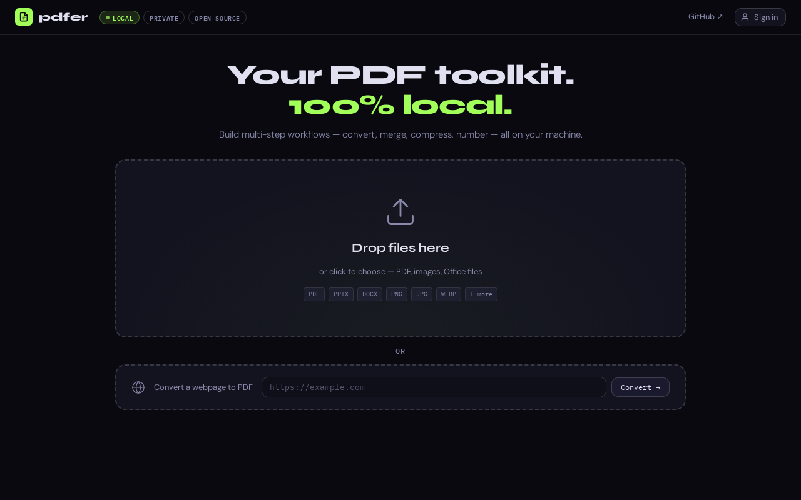
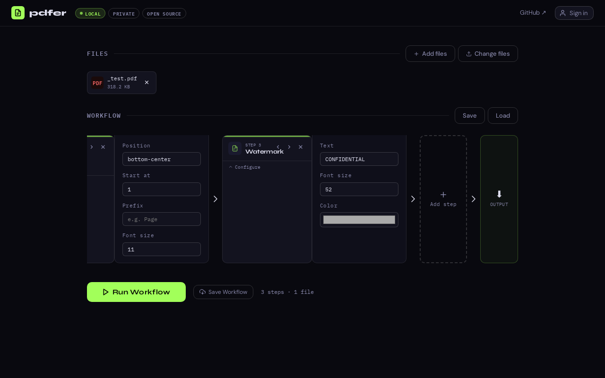

# pdfer

A locally-hosted PDF workflow toolkit with 26 tools. Everything runs on your machine — no files are uploaded to any server. Create a workflow once, save it, never have to do repeat actions on a pdf again.




## Features

### Workflows
Create multi-step pdf workflows for repeat actions. An example workflow might be to convert an uploaded set of Powerpoint slides to pdf, convert those slides to pdfs, merge them, and add page numbers and a watermark.



### Edit & Transform
| Tool | Description |
|------|-------------|
| Compress PDF | Shrink file size using Ghostscript (up to 98% reduction) |
| Grayscale | Convert pages to black and white |
| Rotate Pages | Rotate all or selected pages by 90 / 180 / 270° |
| Watermark | Stamp diagonal text across every page |
| Flatten PDF | Bake in annotations and form fields |
| Add Page Numbers | Stamp sequential page numbers on every page |
| Header & Footer | Add custom text with `{page}`, `{total}`, `{date}` tokens |

### Organize
| Tool | Description |
|------|-------------|
| Merge PDFs | Combine multiple PDFs into one |
| Split PDF | Drag pages into groups — each group becomes its own file |
| Split to Pages | Explode a PDF into one file per page |
| Organize Pages | Drag and drop to reorder or remove pages |
| Interleave Pages | Fix double-sided scans by alternating pages from two PDFs |

### Convert
| Tool | Description |
|------|-------------|
| Convert to PDF | Convert PNG, JPG, WEBP, PPTX, DOCX, XLSX and more to PDF |
| PDF to Images | Render each page as PNG or JPEG (delivered as a ZIP) |
| PDF to Word / PowerPoint | Convert PDF to DOCX or PPTX via LibreOffice |
| PDF to Markdown | Extract content as clean Markdown |
| PDF to Webpage | Convert PDF to a self-contained HTML file |
| Webpage to PDF | Render any URL to a PDF using a headless browser |

### Sign & Protect
| Tool | Description |
|------|-------------|
| Sign PDF | Draw or type a signature, drag to position — supports multiple signatures per page |
| Protect PDF | Encrypt with a password to restrict opening or editing |
| Unlock PDF | Remove password protection (you must know the password) |

### Extract & Metadata
| Tool | Description |
|------|-------------|
| Extract Text | Pull all text out of a PDF as a `.txt` file |
| Extract Images | Pull out all embedded images as a ZIP |
| Edit Metadata | Set title, author, subject, and keywords |
| Rename PDFs | Rename output files using templates like `invoice_{date}` |

## Installation

**Requirements:** Python 3.10+, [LibreOffice](https://www.libreoffice.org/download/download-libreoffice/) (for Office conversions), [Ghostscript](https://ghostscript.com/releases/gsdnld.html) (for compression)

```bash
git clone https://github.com/uspeter1/pdfer
cd pdfer
pip install -r requirements.txt
playwright install chromium   # for Webpage to PDF
python app.py
```

Then open **http://localhost:7265** in your browser.

## Usage

1. Drop files onto the upload zone (or paste a URL in the "Convert a webpage to PDF" box)
2. Add workflow steps — chain as many tools as you like
3. Click **Run Workflow** and download the results

Workflows can be saved and reloaded. All processing is local — your files never leave your machine.

## Privacy

pdfer has no telemetry, no cloud backend, and no accounts required. The optional sign-in feature is purely local (SQLite) and is only needed to save/load workflows across sessions.

## License

MIT
